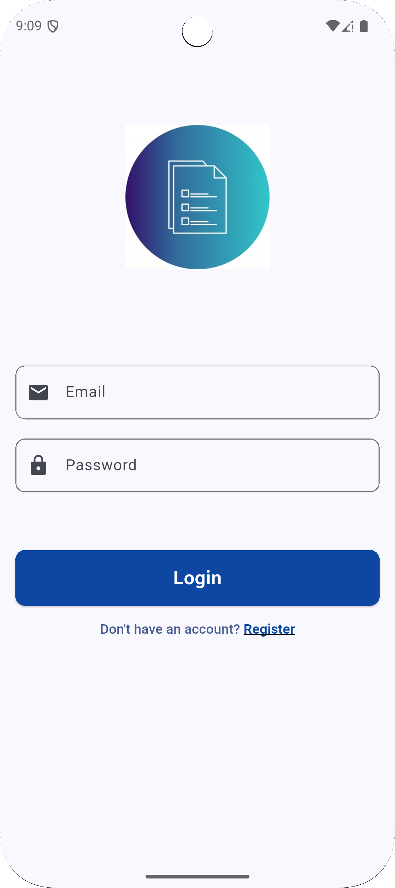
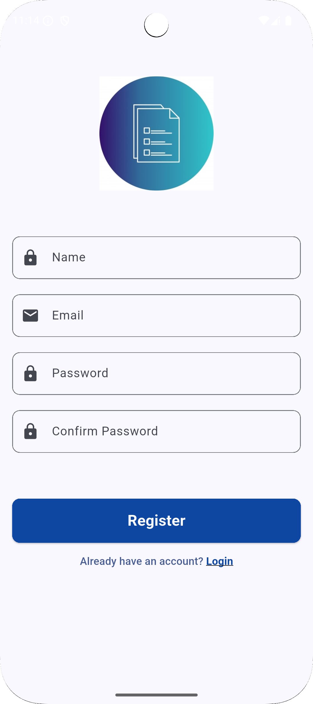
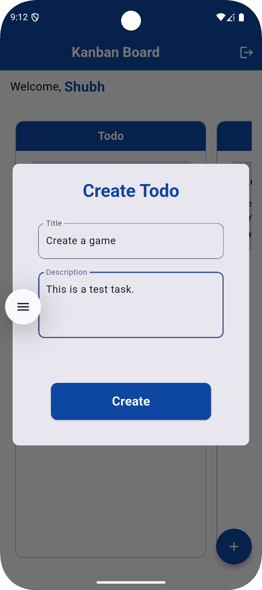
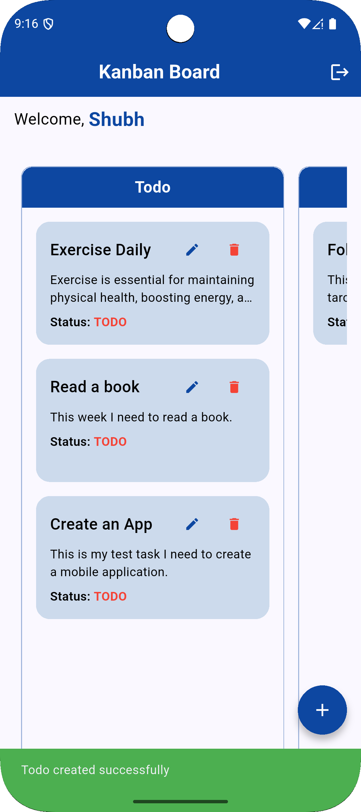
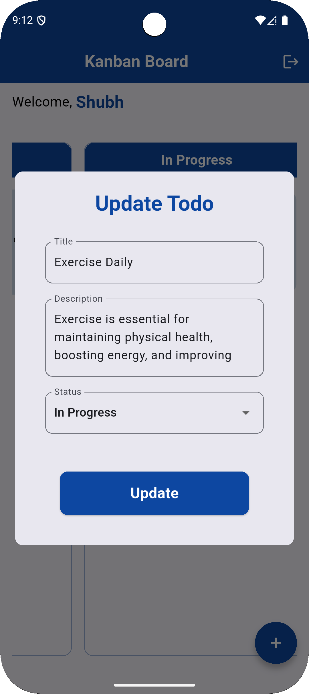
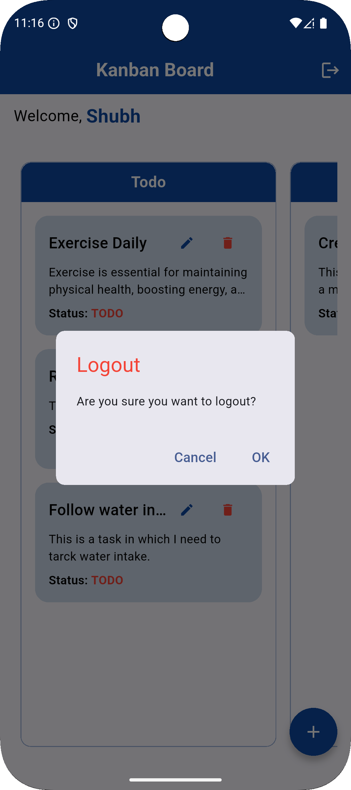

# ✅ Flutter Todo App

A clean, modern, and efficient **Todo Application** built with Flutter.  
Users can register, log in, and manage their todos with real-time updates using **Firebase**, and persistent local storage using **Hive** for caching.

---

## 🚀 Features

- 🔐 **Authentication**
    - User registration & login using **Firebase Authentication**

- 📝 **Todo Management**
    - Add, update, delete todos
    - Todos are synced in real-time using **Firebase Cloud Firestore**

- 📦 **Offline Caching**
    - Caching and local storage with **Hive** for offline access and faster performance

- ☁️ **Cloud Storage**
    - Firebase Cloud Firestore is used to persist todos securely

- 📱 **Responsive UI**
    - Built with Flutter's modern UI components for clean and intuitive user experience

---

## 📸 Screenshots

| Login                                | Register                                   | Create Todo                                 |
|--------------------------------------|--------------------------------------------|---------------------------------------------|
|  |  |  |

| Todo Board                                | Update Todo                                 | Delete Todo                             |
|-------------------------------------------|---------------------------------------------|-----------------------------------------|
|  |  |  |

---

## 🎥 Todo Preview


---

## 🧰 Tech Stack

- **Flutter** – UI Development
- **Firebase Auth** – User Authentication
- **Firebase Cloud Storage** – Todo Storage
- **Hive** – Local database & caching
- **Cubit** – State Management for handling states 

---

## 📦 Installation & Setup

1. **Clone the Repository**
   ```bash
   git clone https://github.com/shubhamgayakwad6334/codebase_assignmet.git
   cd codebase_assignmet
